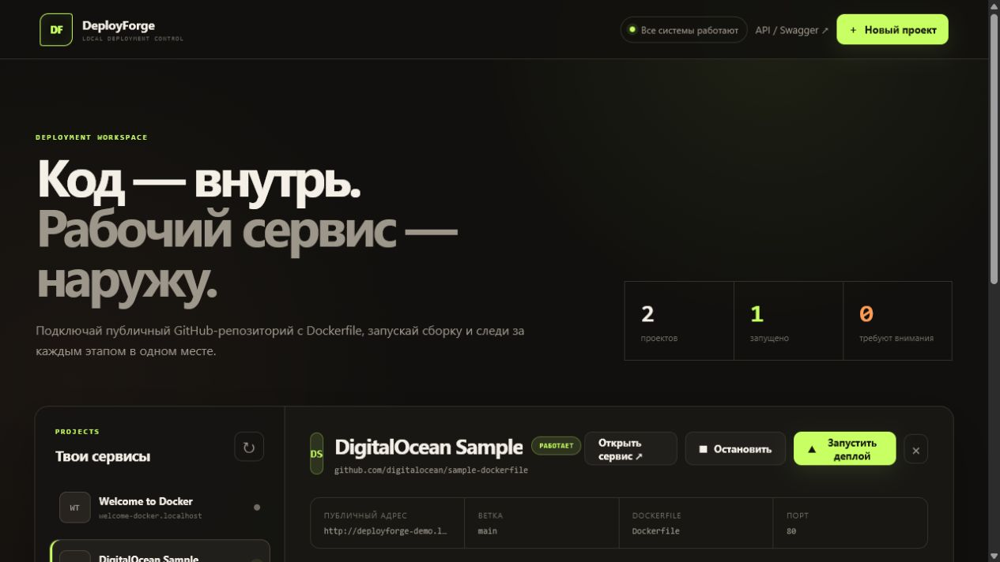
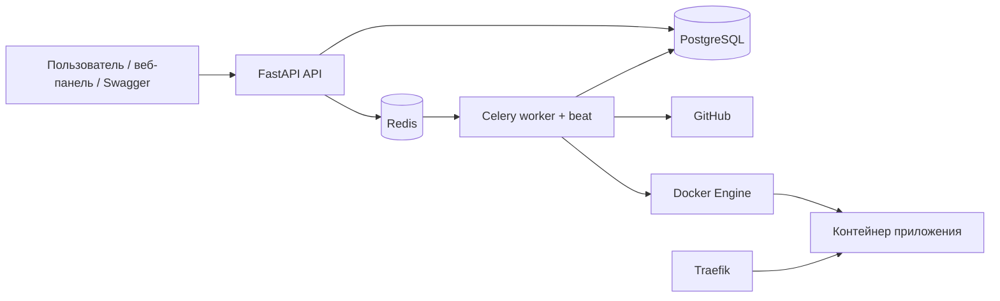
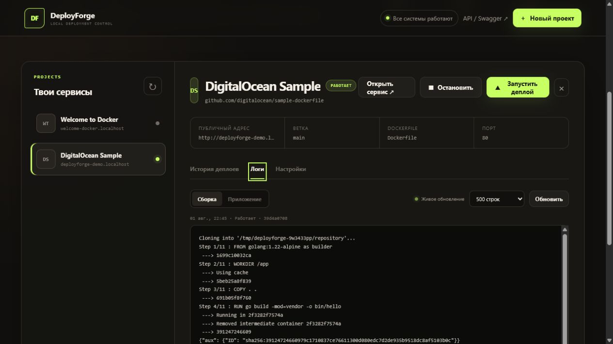

# DeployForge

DeployForge — локальный мини-аналог Render/Heroku для учебных и портфолио-задач. Он
принимает ссылку на публичный GitHub-репозиторий с Dockerfile, собирает образ в фоне,
запускает контейнер и публикует его через Traefik по адресу вида
`http://my-app.localhost`.




## Зачем этот проект

DeployForge показывает полный жизненный цикл локальной платформы деплоя: от HTTP-запроса
и фоновой очереди до сборки недоверенного Dockerfile, переключения контейнеров, маршрутизации
и наблюдения за логами. Это не макет интерфейса — все действия панели управляют реальными
Docker-контейнерами через API.

Ключевые инженерные решения:

- FastAPI отвечает быстро и только создаёт запись deployment и задачу Celery;
- PostgreSQL остаётся единственным источником истины, Redis используется только как брокер;
- worker изолирует Git/Docker-операции от API и выполняет их без shell-команд;
- предыдущая рабочая версия сохраняется до успешного запуска кандидата;
- повторная доставка задачи не создаёт дублирующиеся контейнеры;
- Traefik автоматически публикует каждый сервис по адресу `<slug>.localhost`;
- SSE передаёт build- и runtime-логи в панель без перезагрузки страницы.

Полный показ проекта занимает около пяти минут: [сценарий демонстрации](docs/DEMO.md).

> [!CAUTION]
> Worker получает полный доступ к Docker Engine через `/var/run/docker.sock`. Сборка
> Dockerfile также выполняет код из репозитория. Используйте только собственные или
> проверенные репозитории и не публикуйте этот MVP в интернет.
>
> Секреты шифруются в PostgreSQL, но передаются приложению как Docker environment variables.
> Пользователь с доступом к Docker Engine может увидеть окружение контейнера. Не используйте
> DeployForge как публичное хранилище секретов.

## Что уже работает

- создание и управление проектами через веб-панель или FastAPI/Swagger;
- очередь Redis + Celery, не блокирующая HTTP-запрос;
- неглубокое клонирование публичного GitHub-репозитория;
- сборка локального Docker-образа с тегом по commit SHA;
- запуск и проверка контейнера, включая Docker `HEALTHCHECK`;
- адрес `<slug>.localhost` через автоматические метки Traefik;
- история и статусы `queued/cloning/building/starting/running/failed/stopped/cancelled`;
- сборочные и runtime-логи в PostgreSQL;
- живое обновление сборочных и runtime-логов через SSE;
- зашифрованные переменные окружения с маскировкой секретов в API и панели;
- фоновая остановка и повторный запуск сохранённого контейнера;
- ручной откат к любой доступной остановленной версии с автоматическим восстановлением;
- безопасная отмена активного деплоя с очисткой кандидата;
- сохранение старой версии до успешной сборки и её восстановление при ошибке запуска;
- фоновая очистка контейнеров и образов при удалении проекта.

Авторизация, private repositories, webhook, registry,
Kubernetes и Grafana намеренно оставлены за пределами первого MVP.
Порты API и Traefik по умолчанию привязаны только к `127.0.0.1`.

## Архитектура



API не имеет Docker-сокета. Worker периодически читает последние логи запущенных
контейнеров и сохраняет их в PostgreSQL, откуда их возвращает API.

## Требования

- Docker Desktop с включённым режимом Linux containers;
- Docker Compose;
- Git нужен только для разработки самого DeployForge, не для запуска стека.

Python и Node.js на Windows устанавливать не требуется: API, миграции, worker и тесты
можно запускать внутри контейнеров.

## Запуск

1. Запустите Docker Desktop и дождитесь готовности Engine.
2. При необходимости скопируйте `.env.example` в `.env` и измените порты или пароль.
3. Запустите стек:

   ```powershell
   docker compose up --build -d
   docker compose ps
   ```

4. Откройте панель DeployForge: <http://localhost:8000>.

Swagger остаётся доступен по адресу <http://localhost:8000/docs> для ручной проверки API.

## Веб-панель

Встроенный интерфейс не требует отдельного Node-сервиса и запускается вместе с FastAPI. В нём можно:

- создавать проекты и выбирать их в общем списке;
- редактировать название, репозиторий, ветку и путь к Dockerfile;
- запускать деплой и видеть текущий этап с автообновлением;
- отменять деплой во время очереди, клонирования, сборки или запуска;
- останавливать сервис и снова запускать сохранённую версию;
- откатываться к доступному предыдущему деплою из истории;
- открывать опубликованный сервис;
- просматривать историю, commit SHA, длительность и ошибки запусков;
- переключаться между сборочными и runtime-логами;
- следить за логами без ручного обновления страницы;
- удалять проект с подтверждением и фоновой очисткой Docker-ресурсов.

Панель адаптирована для узких экранов, а Swagger сохранён как технический интерфейс.



## Логи в реальном времени

При открытии вкладки «Логи» панель подключается к SSE-потоку выбранного deployment.
Worker сохраняет прогресс Docker-сборки с небольшим интервалом, а runtime-логи обновляет
фоновый сборщик. Соединение автоматически переподключается при кратком сбое и закрывается,
когда deployment переходит в `failed`, `stopped` или `cancelled`. Для работающего приложения
поток остаётся открытым и показывает новые runtime-записи.

Обычный `GET /deployments/{id}/logs` сохранён как резервный и удобный для Swagger вариант.

## Редактирование проекта

Откройте вкладку «Настройки» и нажмите «Редактировать». Название, GitHub URL, ветку и
путь к Dockerfile можно менять, когда не выполняется деплой или фоновая операция.
Новая конфигурация сборки применяется при следующем деплое и не перезапускает текущий
контейнер автоматически.

После создания первого контейнера slug и внутренний порт закрепляются: они используются
в Traefik-маршрутах сохранённых версий и нужны для безопасного запуска и rollback. Чтобы
изменить их, создайте новый проект. Если проект остановлен, новый деплой можно запустить
сразу — предварительно запускать старую версию не требуется.

## Отмена деплоя

Во время активного деплоя в панели появляется кнопка «Отменить деплой». Для задачи в
очереди отмена применяется сразу. Во время клонирования, сборки или запуска API сохраняет
запрос в PostgreSQL, а worker завершает текущую безопасную операцию, удаляет контейнер-
кандидат и переводит deployment в `cancelled`. Если старая рабочая версия уже была
остановлена для переключения, worker запускает её снова.

Отмена кооперативная: worker не завершается принудительно и поэтому не оставляет базу в
неопределённом состоянии. Продолжительный отдельный шаг Git или Docker может закончиться
до ближайшей контрольной точки отмены.

## Переменные окружения и секреты

Откройте проект, перейдите на вкладку «Настройки» и добавьте пары `KEY=value`.
Отметка «Секрет» скрывает значение после сохранения: API возвращает только ключ и признак,
что значение задано. Все значения шифруются перед записью в PostgreSQL и расшифровываются
worker только при запуске нового контейнера.

Изменения применяются со следующего деплоя. Во время активного деплоя редактирование
окружения заблокировано, чтобы запущенная версия получила согласованный набор настроек.

Перед сохранением настоящих ключей задайте уникальный `DEPLOYFORGE_SECRET_KEY` длиной не
менее 16 символов в `.env`. Не меняйте его после сохранения переменных: без прежнего ключа
расшифровать существующие значения невозможно.

Если порт `80` занят, задайте, например, `DEPLOYFORGE_HTTP_PORT=8088` в `.env`.
Тогда адрес приложения будет `http://<slug>.localhost:8088`.

Если PowerShell `Invoke-WebRequest` возвращает `503`, а приложение открывается в браузере,
проверьте адрес без системного HTTP-прокси:

```powershell
curl.exe --noproxy "*" --resolve my-app.localhost:80:127.0.0.1 http://my-app.localhost/
```

Параметр `--resolve` нужен только для такой диагностики и не относится к DeployForge:
некоторые настройки Windows отправляют даже домены `.localhost` через внешний прокси.

## Первый деплой

Создайте проект через `POST /projects`:

```json
{
  "name": "My API",
  "slug": "my-api",
  "repo_url": "https://github.com/your-name/your-public-repository",
  "branch": null,
  "dockerfile_path": "Dockerfile",
  "container_port": 8080
}
```

Затем вызовите `POST /projects/{project_id}/deploy`. Запрос сразу вернёт deployment со
статусом `queued`. Состояние проверяется через `GET /deployments/{deployment_id}`, а
логи — через `GET /deployments/{deployment_id}/logs?tail=500`.

Приложение внутри контейнера обязано слушать `0.0.0.0`, а не `127.0.0.1`. Поле
`container_port` должно совпадать с фактическим портом процесса; инструкция `EXPOSE`
сама по себе порт не открывает.

В каталоге `examples/demo-app` находится минимальное приложение для локальных
интеграционных тестов. Production API специально не принимает локальные пути — для
ручного полного теста поместите этот пример в собственный публичный GitHub-репозиторий.

## API

| Метод | Путь | Назначение |
|---|---|---|
| `GET` | `/health` | Проверка PostgreSQL и Redis |
| `POST` | `/projects` | Создать проект |
| `GET` | `/projects` | Получить проекты и последние статусы |
| `GET` | `/projects/{id}` | Получить проект |
| `PATCH` | `/projects/{id}` | Изменить настройки проекта |
| `GET` | `/projects/{id}/variables` | Получить окружение с замаскированными секретами |
| `PUT` | `/projects/{id}/variables` | Заменить набор переменных окружения |
| `DELETE` | `/projects/{id}` | Поставить очистку проекта в очередь |
| `POST` | `/projects/{id}/deploy` | Поставить деплой в очередь |
| `POST` | `/projects/{id}/stop` | Остановить текущую версию в фоне |
| `POST` | `/projects/{id}/start` | Запустить последнюю остановленную версию в фоне |
| `POST` | `/projects/{id}/rollback` | Откатиться к указанному deployment в фоне |
| `GET` | `/projects/{id}/deployments` | История деплоев |
| `GET` | `/deployments/{id}` | Статус деплоя |
| `GET` | `/deployments/{id}/logs` | Сборочные и runtime-логи |
| `GET` | `/deployments/{id}/logs/stream` | SSE-поток живых логов |
| `POST` | `/deployments/{id}/cancel` | Запросить отмену активного деплоя |

## Проверки

Локально с Python:

```powershell
pip install ".[dev]"
ruff check .
ruff format --check .
mypy app
pytest
```

Без Python на хосте:

```powershell
docker build --target test -t deployforge-tests .
docker run --rm deployforge-tests
```

Docker-интеграционный тест запускается отдельно, потому что ему нужен Docker socket:

```powershell
docker run --rm --user root `
  -e DEPLOYFORGE_RUN_DOCKER_TESTS=1 `
  -v /var/run/docker.sock:/var/run/docker.sock `
  deployforge-tests `
  pytest -p no:cacheprovider tests/test_docker_integration.py
```

Основная проверка контейнеров:

```powershell
docker compose config
docker compose build
docker compose up -d
docker compose ps
```

## Остановка

`docker compose down` останавливает управляющий стек, но сохраняет PostgreSQL volume.
Развёрнутые приложения создаются через Docker Engine отдельно от Compose. Удаляйте их
через `DELETE /projects/{id}` до остановки worker. Полное удаление базы выполняется
только явной командой `docker compose down -v`.
